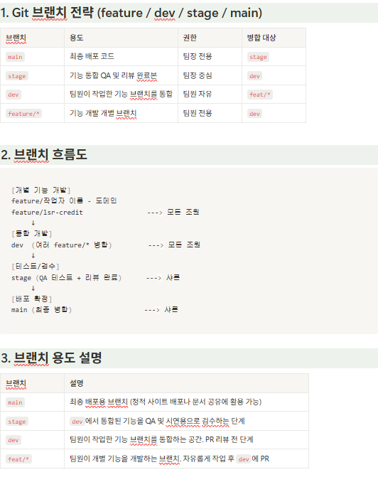

# 🛍️ 텀블러 쇼핑몰 프로젝트

> **Java + Spring 기반 쇼핑몰 기능 구현 프로젝트 (Toy Project)**  
> 회원가입, 상품 목록, 주문, 장바구니, 게시판 등 쇼핑몰의 기본 및 심화 기능을 구현합니다.

---

## 📌 프로젝트 개요

| 항목 | 내용 |
|------|------|
| **진행 기간** | 2025.06.16 ~ 2025.06.27 |
| **목표** | 쇼핑몰 기능 구현을 통해 스프링 기반 웹 애플리케이션 개발 역량 강화 |
| **주요 기능** | 회원가입/로그인, 상품 조회, 게시판, 장바구니, 주문 처리 등 |
| **기술 스택** | Java 17, Spring MVC, MyBatis, MySQL, JSP, HTML/CSS/JS |

---

## ⚙️ 프로젝트 환경 구성

| 항목 | 설정 내용 |
|------|------------|
| **언어** | Java 17 |
| **프레임워크** | Spring Framework (MVC 구조 기반) |
| **ORM** | MyBatis (Interface + XML Mapper 방식) |
| **DBMS** | MySQL |
| **빌드 도구** | Maven |
| **데이터 전송 객체** | VO (DB 연동용), DTO (요청/응답용) |
| **뷰 템플릿** | JSP + JSTL + JavaScript (Vanilla) |
| **템플릿 구조** | Controller / Service / Mapper / Layout(Header/Footer 포함) |
| **의존성 관리** | `pom.xml` 기반 |
| **테스트 도구** | Postman, JUnit |
| **IDE** | IntelliJ 또는 Eclipse |
| **실행 환경** | 내장 또는 외부 Tomcat 9.x |
| **배포 환경** | 로컬 개발 및 실행 중심 |
| **배포** | http://mykakusi.tplinkdns.com/main |

---

## 🧱 설계 규칙 및 구조

### 📁 패키지 구조 예시
```text
src/main/java
└── controller/
└── user/
└── product/
└── service/
└── user/
└── mapper/
└── user/
└── dto/
└── vo/
```


### 📌 명명 규칙

| 유형 | 예시 |
|------|------|
| Controller | `UserController` |
| Service | `ProductService` |
| Mapper Interface | `UserMapper` |
| Mapper XML | `UserMapper.xml` |
| VO | `UserVO`, `ProductVO` |
| DTO | `LoginRequestDTO`, `OrderResponseDTO` |

---

## 🚀 Git 전략


**노션페이지** https://www.notion.so/Git-2139047c353d80c0bde4cb890c344e63


### 🔧 브랜치 전략

| 브랜치           | 용도 | 병합 대상 |
|---------------|------|------------|
| `main`        | 최종 배포용 브랜치 | `stage` |
| `stage`       | QA 및 발표용 브랜치 | `dev` |
| `dev`         | 팀원 기능 통합 브랜치 | `feat/*` |
| `featature/*` | 개별 기능 개발 브랜치 | - |

### 📈 브랜치 흐름도
> feat/* → dev → stage → main

---

## ✅ 커밋 컨벤션

| 타입 | 설명 |
|------|------|
| `feat` | 새로운 기능 추가 |
| `fix` | 버그 수정 |
| `refactor` | 코드 리팩토링 |
| `style` | 코드 포맷팅, 세미콜론 등 |
| `docs` | 문서 수정 |
| `test` | 테스트 코드 추가/수정 |
| `chore` | 빌드 설정, 기타 변경 |

**예시**
```bash
[feat] 회원가입 API 구현
[fix] 장바구니 수량 수정 오류 해결

---

## 🔄 Git 작업 흐름
# dev 브랜치 최신화
git checkout dev
git pull origin dev

# 기능 브랜치 생성
git checkout -b feat/user-join

# 작업 후 커밋
git add .
git commit -m "[feat] 회원가입 기능 구현"

# 원격 브랜치 푸시
git push origin feat/user-join

# GitHub에서 PR 생성 (feat/user-join → dev)
```
---

## 📎 기타

1. 프로젝트는 로컬 실행을 기준으로 작성되었으며, 운영 배포를 고려하지 않습니다.
2. 모든 작업은 Git을 통해 관리되며, PR 기반 리뷰 및 병합 방식을 따릅니다.
3. 기본 Controller / Service / Mapper / xml 구조와 주석 기반 템플릿을 팀장이 제공하여 협업을 진행합니다.
